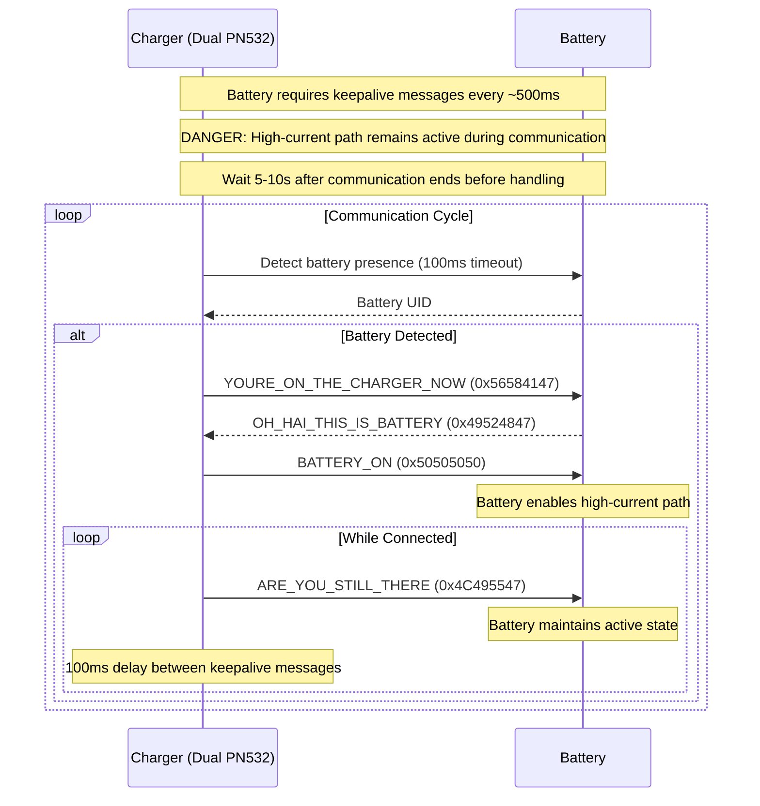

# reunu Battery Charger

Arduino sketch for communicating with unu Scooter Pro batteries via NFC to enable charging functionality. The sketch emulates the charger's communication protocol to unlock the battery's high-current path, allowing charging operations.

⚠️ WARNING

> **Note:** Battery requires continuous communication to maintain active state. Without regular keepalive messages, it will deactivate after approximately 1.5 seconds.

🚨 DANGER

> **Warning:** Battery high-current path becomes active during communication. Wait 5-10 seconds after terminating NFC communication before handling the battery.

## Overview

unu Scooter Pro batteries utilize NFC for device communication and state management. The battery's integrated Battery Management System (BMS) requires a NFC handshake and keepalive via NFC before enabling the high-current path for charging or discharging operations.

This implementation supports redundant NFC communication through dual PN532 readers, automatically selecting and maintaining connection with whichever reader first establishes communication with the battery.

## Hardware Configuration

- Dual PN532 NFC readers (SPI mode)
- Primary reader: CS on D8
- Secondary reader: CS on D4
- Shared SPI bus (D5: SCK, D6: MISO, D7: MOSI)

For high-speed microcontrollers (ESP8266/ESP32), the Adafruit_PN532 library requires timing modifications. Modify line 336 in Adafruit_PN532.cpp to include consistent delay(SLOWDOWN) to ensure reliable communication timing.

## Communication Protocol

## Battery Status Information

The sketch can read various battery parameters from specific memory pages:

- Page 0xC0: Voltage and current
- Page 0xC1: Available current and remaining charge
- Page 0xC2: Full charge capacity and fault codes
- Page 0xC3: Temperature sensors and state of health
- Page 0xC4: Battery state (4 byte)

## Command Interface

Commands are written to page 0xCC. Expected responses should be read from the same page. The protocol implements a 2000ms timeout for response verification, checking for either:
- Expected response pattern
- Command buffer clearing (all zeros)

## Implementation Notes

1. Dual Reader Management
   - Automatic selection of first responding reader
   - Continuous connection maintenance until tag loss
   - Automatic fallback to reader scanning on connection loss

2. Battery State Monitoring
   - Continuous state and status monitoring during connection
   - Comprehensive fault detection
   - Regular keepalive message transmission

3. Safety Features
   - Response timeout validation
   - Connection loss detection
   - Automatic deactivation on communication failure