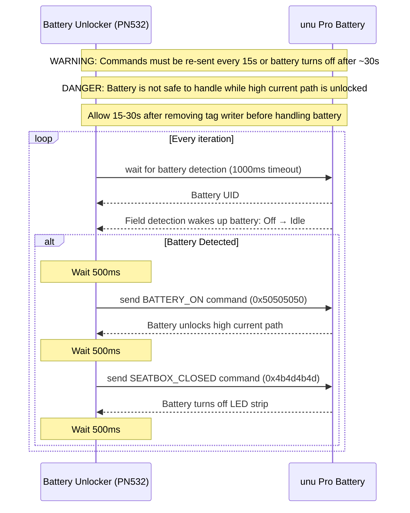

# reunu Battery Unlocker

Arduino sketch to tell the main drive battery of a unu Scooter Pro that it is inside the scooter and ready to scoot, which will get the internal BMS to unlock the high-current path and allow charging or discharging the battery.

⚠️ WARNING

> **Note:** Battery will turn off after ~30 seconds if it does not receive additional messages.

🚨 DANGER

> **Warning:** Battery is not safe to handle while high current path is unlocked. Allow 15-30 seconds after removing tag writer before handling battery.

unu Scooter Pro batteries have NFC chips in them to allow the battery to communicate with devices such as the charger and the scooter. The battery will not allow charging or discharging until unlocked by one of those devices, at which point the integrated BMS will enable the GND pole and allow current to flow.

This sketch unlocks the high current path by telling the battery that it is inside the scooter and the seatbox is closed. At that point, the battery will allow drawing the full voltage and current on the discharge path, or accept charge. Note that you will not get the LED strip animation, because the battery thinks it's inside the closed seatbox. See the `battery-charger` sketch for that.

## Sequence diagram

